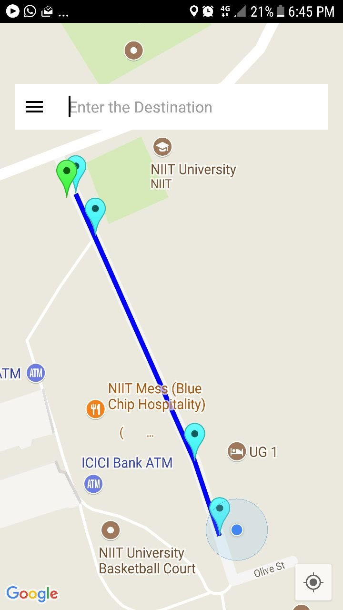
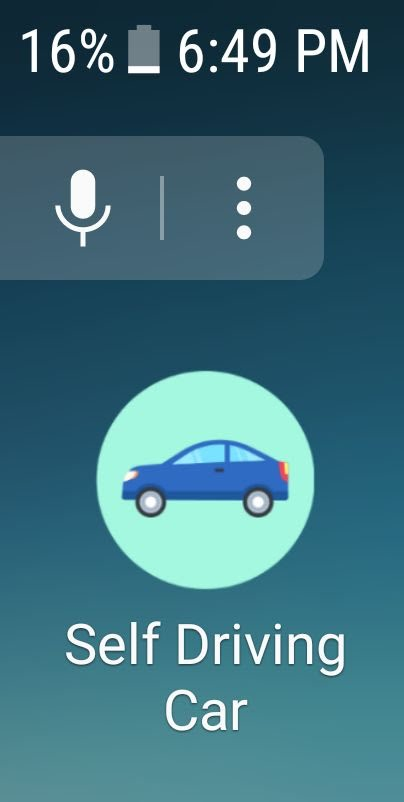
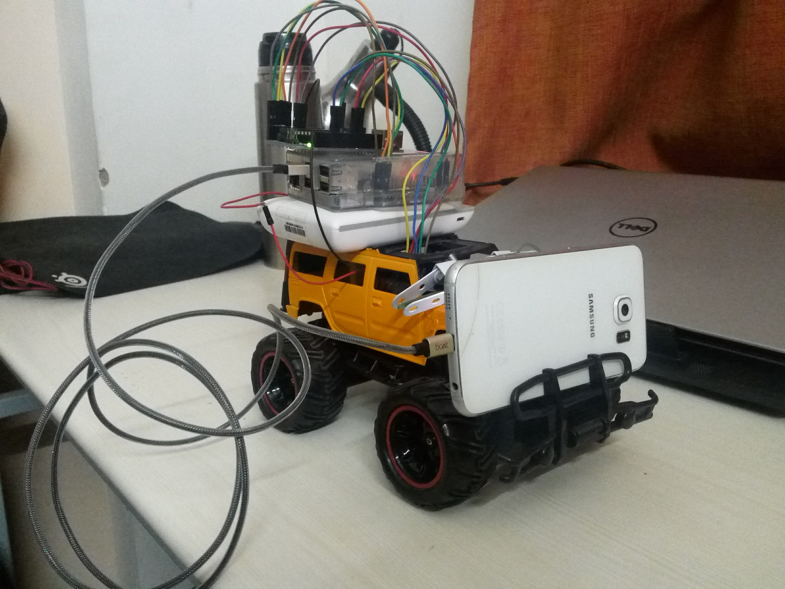
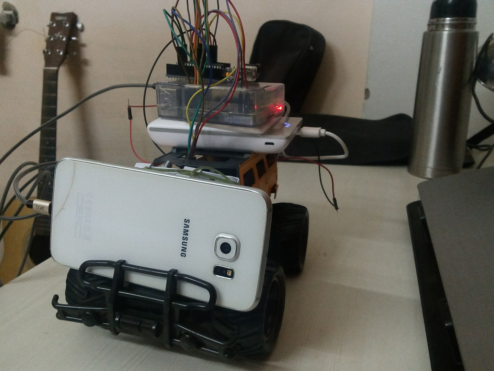
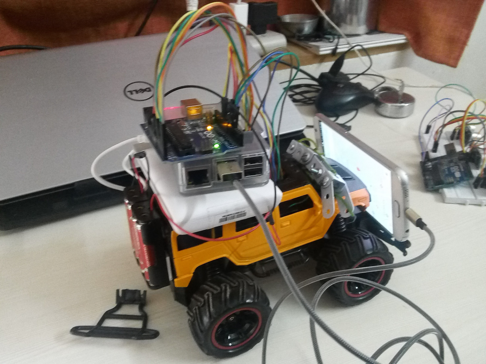
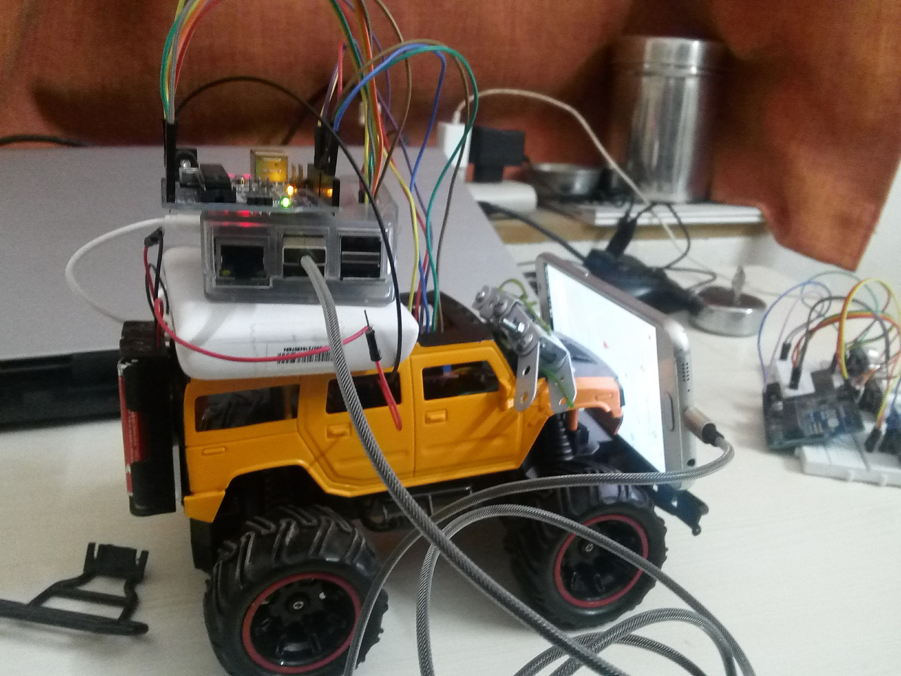

  <h1>Self-Driving Car</h1>
  <h2>Project Volantè</h2>
  <b> Self Driving Car </b> 
  <b> Version <i>1.0</i></b>

  

##### Product : Project Volantè 
##### Description : Self driving RC Car Project
##### Status : Waiting for Review by customer
##### Development Status  : Development Completed

----

#### Product
  - Current Version : 1.0
  - Current Status : Development Completed
  - Date : 29-11-2017
   
   
# Team Project Volantè
<!-- ALL-CONTRIBUTORS-LIST:START - Do not remove or modify this section -->
| [ Shivank Shekhar](https://github.com/GeekyShiva) | [ Sudhanshu Gupta](https://github.com/Sacusa)  | [ Dhruv Parashar](https://github.com/falcon1996)<brs/> | [ Tanmay Eeknath Patil](https://github.com/tanmay-e-patil)  | [ Yash Vaidya](https://github.com/StrawHatDragon100)  | 
| :---: | :---: | :---: | :---: | :---: | 
<!-- ALL-CONTRIBUTORS-LIST:END -->

# Self Driving Car
This repository is for self driving car project developed by undergraduate *Computer Science and Engineering* students at *NIIT University*

# Purpose

The purpose of this document is to provide a debriefed view of requirements and specifications of the project called `Volante`.

The goal of this project is to make an autonomous self-driving car, capable of maneuvering around bends, avoiding obstacles and following traffic signals and road signs.

The tools used in this project and described in this document are:

* TensorFlow library for machine learning
* Vision API by Google Cloud Platform and TensorFlow.

The hardware used in this project and described in this document are:

* RC Car serving as the actual self-driving car
* Arduino Uno used for controlling the car speed and turning radius
* Ultrasonic sensor to detect objects in front of the car
* Raspberry Pi used for capturing and transmission of camera data and communicating with Google Cloud Platform
* PiCamera used for capturing objects in front of the car

# Document Conventions

* All terms are in _italics_ style.
* Main features or important terms are in *bold*.
* TBD means "To be Decided". These are the components that are not yet decided.
* For more references see Terminology.

This document also includes:

* Overall description of the product
* External interface requirements
* System Features
* Other nonfunctional requirements

# Intended Audience and Reading Suggestions

Anyone with some programming experience, with familiarity in *Python* and *C*, can understand this document. The document is intended for developers, software architects, testers, project managers and documentation writers, auto enthusiast and AI/ML developers.

# Product Scope

Road safety has been an issue for as long as cars have been in existence. Over *1.3* million people die of road accidents every year across the globe, most of which are preventable. Ever-rising road traffic has led to an exponential increase in commute time. This has a direct impact not only on people's productivity but also on the environment.

Recent developments in machine learning and artificial intelligence along with the ever-increasing performance of modern day computers have enabled the use of these technologies in developing self-driving cars. These cars have several advantages, as described below:

* Better road safety: Machines are not prone to human-error and distractions, leading to swift and appropriate responses in real-time road conditions.
* Reduced commute time: With cars communicating with each other and using modern GPS systems, commute times can be greatly reduced as self-driving cars reduce the *"phantom effect"* in modern-day traffic.
* Increased productivity: Reduced commute times mean more time can be spent on what matters more.
* Reduced expenditure: Reduction in accidents will directly lead to reduced expenditure on damages.
* Environment-friendly: Efficient driving styles of the self-driving car will lead to lower emissions.
* Solution to parking problem: Most of the modern cities face parking problems and which can be resolved by this solution.
* Better traffic discipline: Better law enforcement can be achieved and traffic can be managed by capping speed in various regions.
* Potential for a new design: Because a vehicle may eventually function as a self-guided train car, the potential for new car designs is huge. With no need for complicated driving tools, self-driving cars could include new ways to relax or to stay entertained.

# Novelty of the Project

Our project was squarely aimed at developing a simple RC self-driving car. This involved developing code for a cloud-based machine learning solution, an Android application for data collection and an embedded system to actuate the car's motors. This project, thus, represents a complete self-driving car solution, instead of forming a part of a complete system.

The entire concept of self-driving cars is alien to the general Indian population. Not much research is being done in India right now on this. This car represents a small, albeit significant, step towards the development of a full-sized, fully-functional self-driving car. Ours is a scalable solution, i.e. with minor modifications, it can be scaled up to a full network of self-driving cars. Communication between such a network is a future research topic that can be looked into.

Please refer this doc for extended reading on: [Novelty of Project Idea](https://github.com/GeekyShiva/Self-Driving-Car/blob/master/Project%20Docs/Novelty%20of%20Project%20Idea.md)

# References

* This document is written in GitHub flavored Markdown.
* IEEE Standard 830-1998 Recommended Practice for Software Requirements Specifications.

# Terminology and Conventions 

| Term | Description |
| --- | --- |
| User | Any living being who is interacting with the software is a _user_.|
| System | The package of all the components which takes input and gives output to demonstrate the features of the software is called a system. |
| Database | Collection of information on different topics related to each other. |
| Library| The collection of tracks inside a directory or across multiple directories forms up a library.|
| Store | This is the persistence layer of the whole system. |
| Classifier| An algorithm that implements classification, especially in a concrete implementation. |
| Tags | A label attached to track which gives extra information about it. |
| GCP | Google Cloud Platform for running the machine learning algorithm |

## Product
This system consists of following components:

* RC Car: analogous to real-world car and tries to mimic it
* Machine Learning Model: makes decisions as to how the car should move
* Arduino and Raspberry Pi: along with motors, form the car’s underlying hardware
* PiCam: collects visual data
* Ultrasonic Sensor (HC - SR04): collects distance data

Refer to our **[Software Requirements Specification](https://github.com/GeekyShiva/Self-Driving-Car/blob/master/Project%20Docs/SRS.md)** document which explains the following aspects about the project:

- Introductions
- Functions
- Dependencies
- External Interface Requirement
- System Features
- Non-functional Requirements

The document sheds a light over the above mentioned topics and gives the reader a prespective to know the project outline completely  

To get a complete overview of the software design and principles used in the project please refer to **[Software Design Document](https://github.com/GeekyShiva/Self-Driving-Car/blob/master/Project%20Docs/SDS.md)**

This document is divided into several sections (see Table of Contents) with intended readers being developers and software managers. Sections have, however, been written in a manner that it can be understood by anyone having some knowledge about software.

This Software Design Specification also includes:

* System architecture description
* Detailed description of components
* Reuse and relationships to other products
* Design decisions and tradeoffs

The design has been made clear using class diagrams and sequence diagrams.

# Tools Used 

Please refer to the document given here, which gives readers details about what are the major tools required to build this project under various catagories like 

- Embedded Systems
- Android and Computer Vision
- Cloud and Machine Learning

**[Tools Used](https://github.com/GeekyShiva/Self-Driving-Car/blob/master/Project%20Docs/Tools.md)**

# Sophistication of the Project 

Here, we are going to discuss what all parameters we have considered while building our product and how many parameters we have been able to cover actually. 

We promised our customers that we will be building a prototype of a self driving car which can be scaled for production.

According to whatever has been mentioned above, we have been successfully able to build our software, which meets all the requirements.

To get the complete report refer our **[Sophistication Document](https://github.com/GeekyShiva/Self-Driving-Car/blob/master/Project%20Docs/Sophistication.md)** 

# Project Prespective and Customer Base

We have also compiled a report which tells the readers about the prespective of this project and the customer base and UX that one should target while developing such projects.

Technology is bringing us tools and solutions that will help make businesses more productive, save them money,
make them money, and, perhaps most importantly, positively impact the customer experience. And, this is just 
the beginning. What used to be something we would only see in the movies is becoming our reality. We are living
in the future

# Screenshot of the Apps

Here is the screenshot of the navigation app that we have built

It depicts the start and the end point for the navigation of the vehicle.

Here is the app that we have built

# Images of the Actual Model

Here are some images of the model that we have developed.

